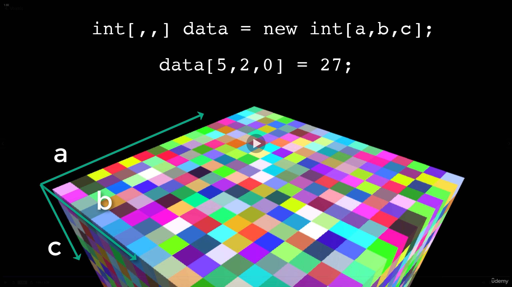
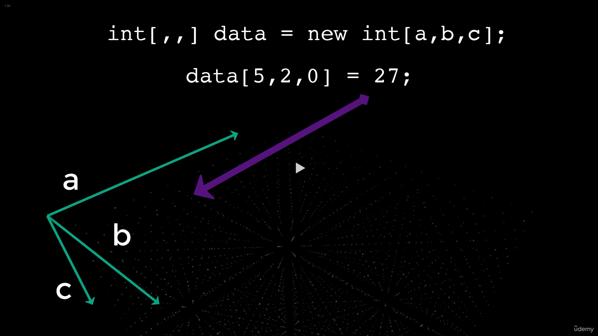
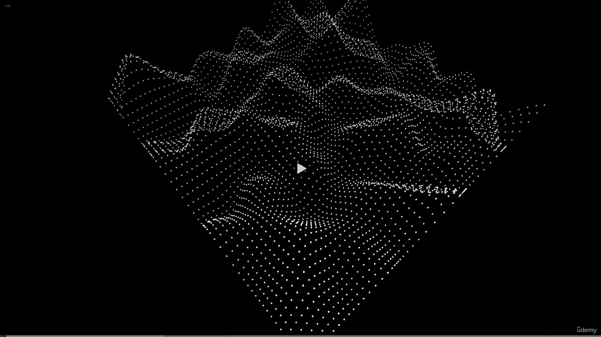
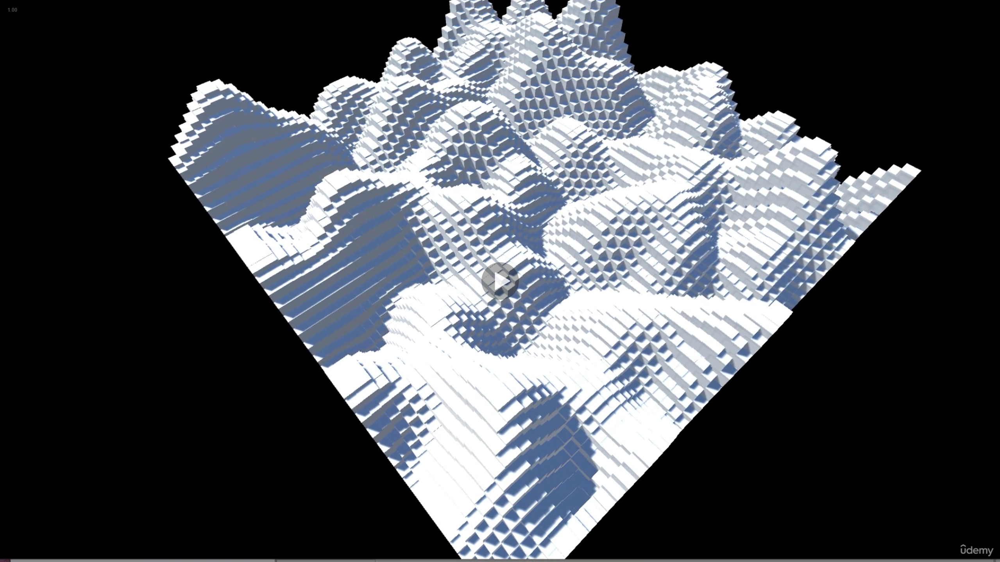
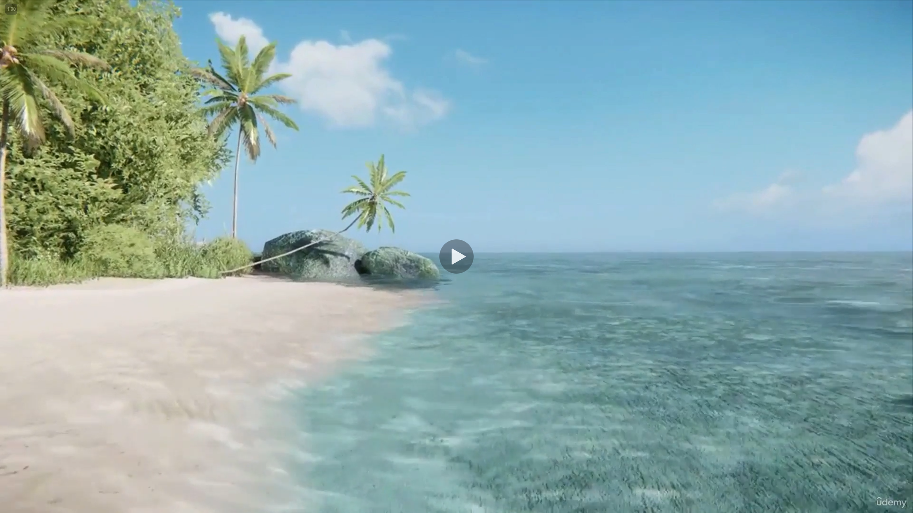

# DEV-01, Voxels
#### Tags: [voxels]

## What are Voxels?
    Voxels are a 3 dimentional equivalent to a pixel.
    They do not have geometry nor do they store their coorinate values within themselves as a pixel

    A pixel is designated by its location with respect to the position of the image
    A voxel is deifined by the relative position inside a a volume.

    voluem + pixel = voxel

## How is it stored?
    Voxel data is stored within a 3 dimentional array
    it is a single data point in the array, not volume.

    data[5,2,0] = 27

    It is only misconcieved as a volume when represented as a three dimentional structure

## How to create a render of Voxel data?
    To create a render, each value needs to be represented by somehting that can be drawn contained within a three dimentional volume.

    in this example, the dimentions of the space are defined by the lengths of each of the dimentions of the array

    and the value contained within each position is represented by a color

    More accurately, the graph should look like this.

    A voxel is not a cube, but a data point devoid of geometry

    Although we see a gap between data points in this illustration, there is inface not space whatsoever. No more than there is gap between values in a two dimentional array.

## Rendering

    The more points that are stored, the greater computer processing and storage required.
    When there is not enough data for one to one voxel to pixel conversion

    The gap can be filled proceedurally, either by smoothing across the gap algorithmically or placing a ploygon in place

    There is a common misconception that a voxel terrain is made from cubes, it can be but it does not have to be. The CryEngine, for example, uses voxels and hight maps for terrains, and you can hardly call one of their landscapes blocky

    Minecraft on the other hand, interprest its voxel world literally through the seeming use of cubes. There is not a single cube used in Minecraft. Minecraft is built atop a voxel dataset that is cleverly hidden by efficient and 
    dynamic meshes.