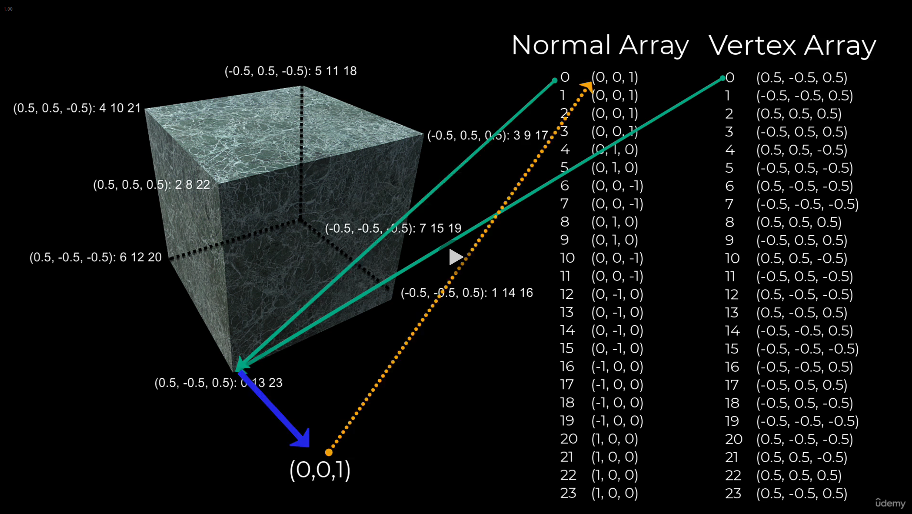

# DEV-03, What is a Cube?
#### Tags: [cube]

## What is it?

    A cube is a form of a mesh that is constructed from a series of polygons. 
    In unity and many other applications, the base polygon is a triangle. One side of a cube is constructed from two triangles.

    A triangle is used as it is the most efficient way to store information about a 3d plane. its surface is flat and consisits of only three vertices.

    In computer graphics, a triangle also has a property called a normal. This is a vector that projects out from the plane 90 degrees from the surface. The normal lets the game engine know which side of the triangle to treat as the one to treat with rendering for textures and lighting.

    It would make it ineffifcient to render a texture that you cant see.

## Continued

    Internally, a mesh for a cube is stored in 4 arrays:
    vertex array
    normal array
    uv array
    triangle array

## Vertex Array

    Vertex array lists all the X, Y, Z coordinates for all the corners of the cube (size 24)

## Normal Array

    Normal array give the normal vector for the corresponding vertex in the Vertex array

## UV Array

    UV array maps the locations in a texture to each vertex defining how each texture is spread over the surface

## Triangle Array

    Triangle array is a list of vertieces in goups of three that define each triangle

## Its all stored here

    The mesh filter, it holds the data of the mesh

    The mesh renderer determines how it is drawn