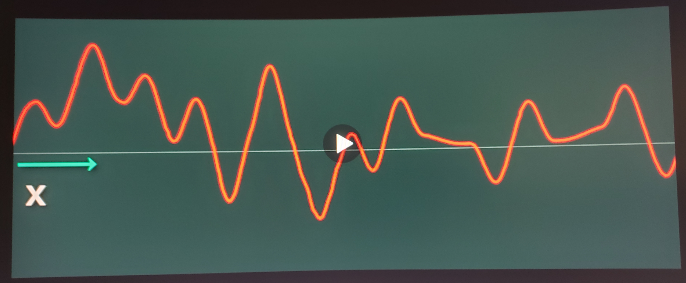
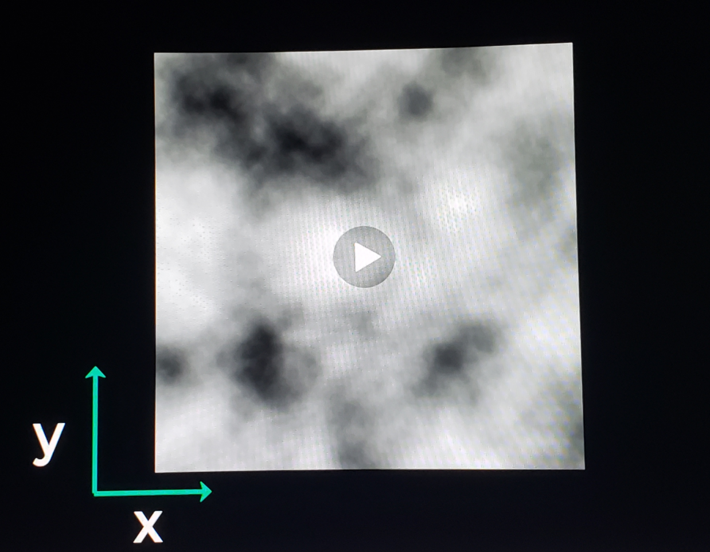
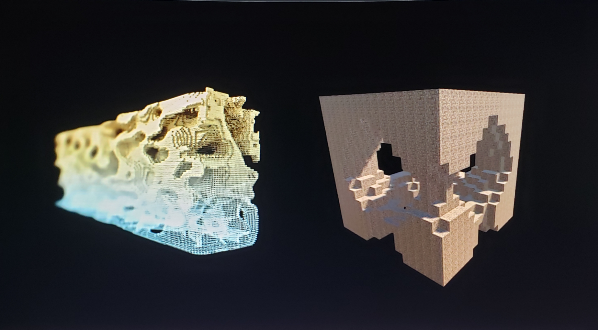
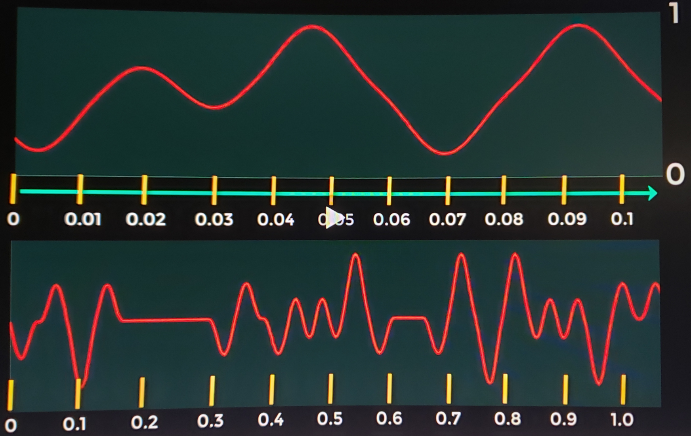
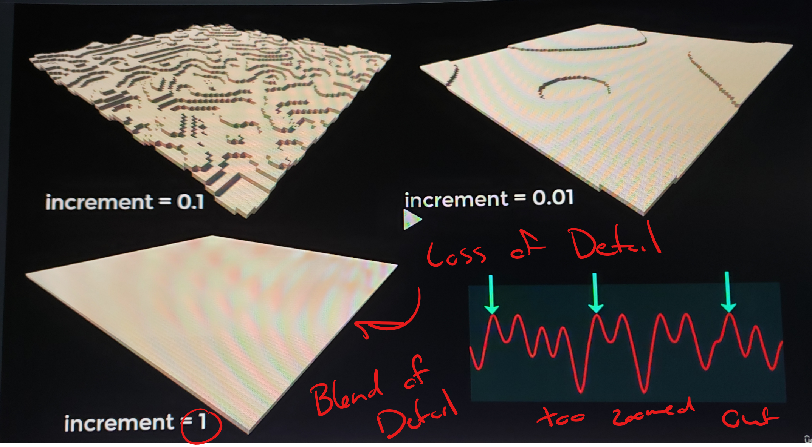
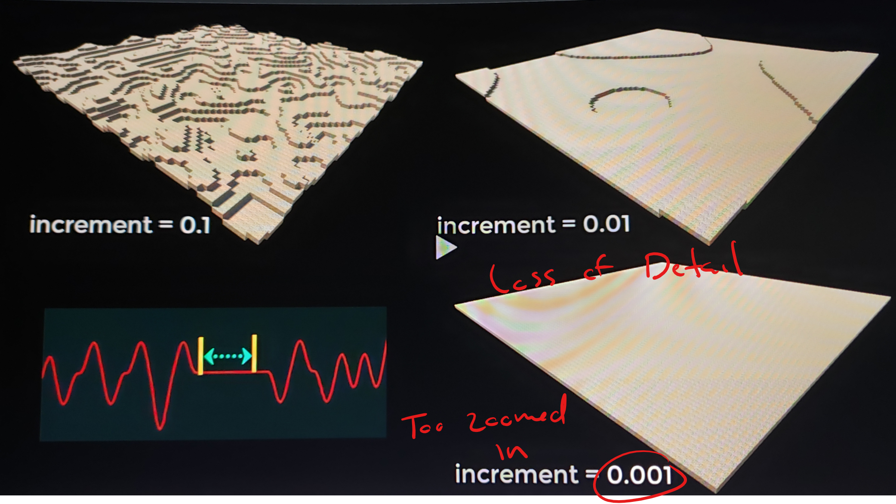
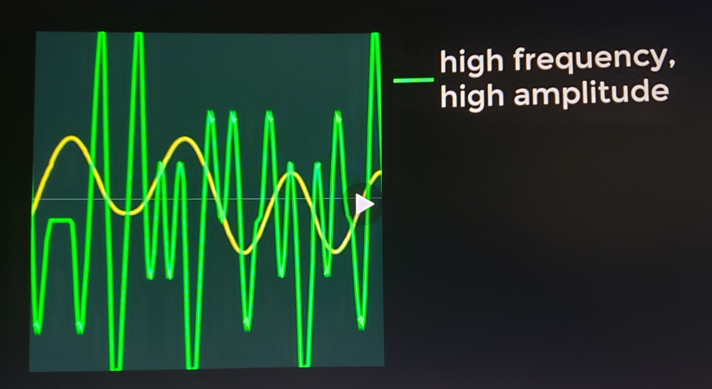
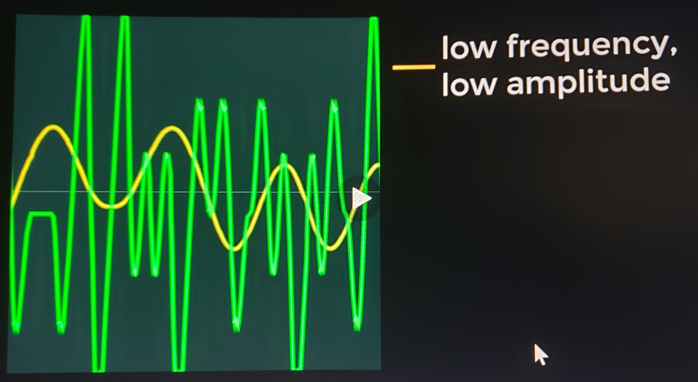

# DEV-12, The Theory of Noise
#### Tags: [noise]

## What is noise?
    Noise is a algorithm for generating wavelets that are seemingly pseudo random but mathematically predictable.
    They are used for procedural generation of terrains and textures.

    Whats so greate about noise generating algorithm to create undulating data is that it has smoothness and predictability. You cant get that with random generation.

## Noise in dimensions

    One dimensional noise appears as a line graph

    Two dimensional noise can be used to generate textures or height values of a landscape

    Three dimentional noise defines areas of volume. It can be used to create volumetric areas in 3D space.
    It is very handy for generating caves.

## Noise details

    Because it is mathematically calculated, it can also be zoomed in the smaller. The increments between the values you send to the function, the smoother the results.

    You can generate more complex wave forms by combining multiple Perlin values

## How to manipulate

    We can control a single perlin noise by modifying its frequency and/or amplitude

    Amplitude refers to the height of the wave.
    Frequency is height the close the peaks and troughs are together.
    Each of these waves is called an octave. By adding multiple octaves togehter we get different frequencies and amplitudes that you can make a simple Perlin noise landscape.

